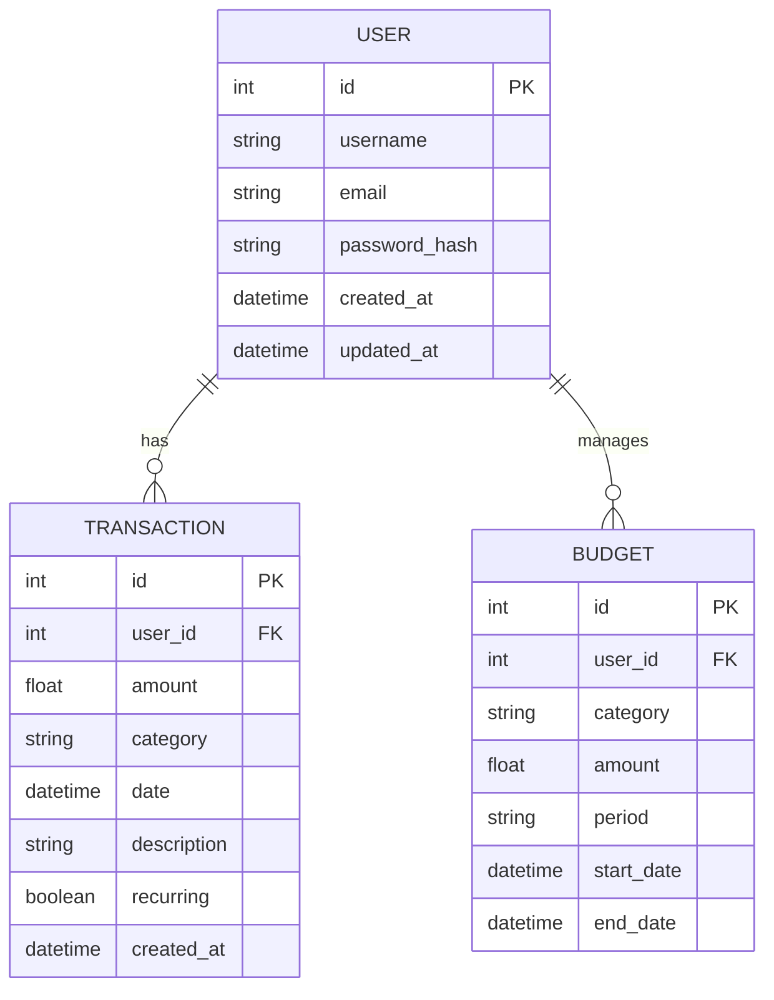

# Personal Finance Tracker - Technical Documentation

## 1. Project Overview

### Purpose and Core Functionality
The Personal Finance Tracker is a web-based application designed to help users manage their personal finances effectively. It provides a comprehensive platform for tracking expenses, managing budgets, and analyzing financial patterns through intuitive visualizations.

### Target Audience
- Individual users seeking to manage personal finances
- Budget-conscious professionals
- Financial planners and advisors
- Anyone looking to improve their financial literacy and spending habits

### Key Features
- **User Authentication & Authorization**
  - Secure registration and login
  - Profile management with customizable settings
  - Role-based access control
- **Transaction Management**
  - Record income and expenses
  - Categorize transactions
  - Recurring transaction support
  - Bulk import/export capabilities
- **Budget Planning**
  - Category-wise budget allocation
  - Real-time budget tracking
  - Budget vs. actual comparison
  - Alert system for budget overruns
- **Financial Analytics**
  - Interactive dashboards
  - Expense pattern visualization
  - Custom report generation
  - Trend analysis
- **Data Security**
  - Encrypted data storage
  - Secure session management
  - Two-factor authentication support

## 2. Technology Stack

### Backend
- **Framework**: Flask 2.3.x
  - Chosen for its lightweight nature and flexibility
  - Perfect for single-file applications
  - Extensive plugin ecosystem
- **Core Libraries**:
  - `Flask-SQLAlchemy`: Database ORM
  - `Flask-Login`: User session management
  - `Flask-WTF`: Form handling and validation
  - `Werkzeug`: Security utilities
  - `PyJWT`: JWT token handling

### Frontend
- **Template Engine**: Jinja2
  - Seamless integration with Flask
  - Powerful template inheritance
- **CSS Framework**: Tailwind CSS 3.x
  - Utility-first approach
  - Highly customizable
  - Optimal for rapid prototyping
- **UI Components**: Flowbite
  - Pre-built accessible components
  - Tailwind CSS integration
  - Modern design patterns
- **JavaScript**:
  - Vanilla JS for DOM manipulation
  - AJAX for asynchronous operations
  - Chart.js for data visualization

### Database
- **System**: SQLite 3
  - File-based database
  - Zero configuration required
  - Perfect for development and small to medium deployments
- **ORM**: SQLAlchemy
  - Powerful query builder
  - Migration support
  - Model relationship management

### Development Tools
- **Version Control**: Git
- **IDE**: VS Code with extensions:
  - Python
  - Tailwind CSS IntelliSense
  - SQLite Viewer
- **API Testing**: Postman/Insomnia
- **Code Quality**:
  - Black (code formatting)
  - Flake8 (linting)
  - PyTest (testing)

### Deployment
- **WSGI Server**: Gunicorn
- **Reverse Proxy**: Nginx
- **Platform Options**:
  - Heroku (PaaS)
  - AWS EC2 (IaaS)
  - DigitalOcean (IaaS)

## 3. Project Structure
```
personal-finance-tracker/
├── app.py                 # Main application file
│   ├── Models
│   ├── Routes
│   ├── Forms
│   └── Utils
├── config.py             # Configuration settings
├── requirements.txt      # Python dependencies
├── package.json          # Node.js dependencies
├── tailwind.config.js    # Tailwind CSS configuration
├── .gitignore           # Git ignore rules
│
├── instance/            # Instance-specific files
│   └── database/        # SQLite database files
│
├── static/              # Static assets
│   ├── css/            # Compiled CSS files
│   │   └── main.css    # Main stylesheet
│   ├── js/             # JavaScript files
│   │   ├── charts.js   # Chart configurations
│   │   └── main.js     # Main JavaScript
│   ├── images/         # Image assets
│   ├── uploads/        # User uploads
│   └── vendor/         # Third-party libraries
│
├── templates/           # Jinja2 templates
│   ├── base.html       # Base template
│   ├── index.html      # Landing page
│   ├── auth/           # Authentication templates
│   │   ├── login.html
│   │   └── register.html
│   ├── dashboard/      # Dashboard templates
│   ├── transactions/   # Transaction templates
│   ├── budgets/        # Budget templates
│   ├── reports/        # Reports templates
│   └── settings/       # Settings templates
│
└── Docs/               # Project documentation
    ├── CONTEXT.md      # Project context
    └── DEVELOPMENT_PLAN.md  # Development roadmap
```

## 4. Python Code Deep Dive

### Core Application Structure (app.py)

#### Models
```python
class User(db.Model):
    id = db.Column(db.Integer, primary_key=True)
    username = db.Column(db.String(80), unique=True, nullable=False)
    email = db.Column(db.String(120), unique=True, nullable=False)
    password_hash = db.Column(db.String(128))
    transactions = db.relationship('Transaction', backref='user', lazy=True)
    budgets = db.relationship('Budget', backref='user', lazy=True)

class Transaction(db.Model):
    id = db.Column(db.Integer, primary_key=True)
    amount = db.Column(db.Float, nullable=False)
    category = db.Column(db.String(50), nullable=False)
    date = db.Column(db.DateTime, nullable=False)
    description = db.Column(db.String(200))
    user_id = db.Column(db.Integer, db.ForeignKey('user.id'), nullable=False)

class Budget(db.Model):
    id = db.Column(db.Integer, primary_key=True)
    category = db.Column(db.String(50), nullable=False)
    amount = db.Column(db.Float, nullable=False)
    period = db.Column(db.String(20), nullable=False)
    user_id = db.Column(db.Integer, db.ForeignKey('user.id'), nullable=False)
```

#### Key Routes
```python
@app.route('/dashboard')
@login_required
def dashboard():
    transactions = Transaction.query.filter_by(user_id=current_user.id).order_by(Transaction.date.desc()).limit(5)
    budgets = Budget.query.filter_by(user_id=current_user.id).all()
    return render_template('dashboard.html', transactions=transactions, budgets=budgets)

@app.route('/transaction/add', methods=['POST'])
@login_required
def add_transaction():
    form = TransactionForm()
    if form.validate_on_submit():
        transaction = Transaction(
            amount=form.amount.data,
            category=form.category.data,
            date=form.date.data,
            description=form.description.data,
            user_id=current_user.id
        )
        db.session.add(transaction)
        db.session.commit()
        flash('Transaction added successfully!', 'success')
        return redirect(url_for('transactions'))
    return render_template('transaction_form.html', form=form)
```

#### Error Handling
```python
@app.errorhandler(404)
def not_found_error(error):
    return render_template('errors/404.html'), 404

@app.errorhandler(500)
def internal_error(error):
    db.session.rollback()
    return render_template('errors/500.html'), 500
```

## 5. Database Schema

### Entity-Relationship Diagram


### Key SQL Queries

#### Monthly Spending by Category
```sql
SELECT category, SUM(amount) as total
FROM transactions
WHERE user_id = ? 
AND date >= date('now', 'start of month')
GROUP BY category
ORDER BY total DESC;
```

#### Budget Progress
```sql
SELECT b.category, b.amount as budget,
       COALESCE(SUM(t.amount), 0) as spent
FROM budgets b
LEFT JOIN transactions t 
  ON b.category = t.category 
  AND b.user_id = t.user_id
  AND t.date >= b.start_date
  AND t.date <= b.end_date
WHERE b.user_id = ?
GROUP BY b.category, b.amount;
```

## 6. Frontend Architecture

### Template Hierarchy
```
base.html
├── auth/
│   ├── login.html
│   └── register.html
├── dashboard.html
├── transactions/
│   ├── list.html
│   └── form.html
├── budgets/
│   ├── overview.html
│   └── form.html
└── reports/
    └── analytics.html
```

### Key JavaScript Components

#### Transaction Form Handling
```javascript
document.getElementById('transactionForm').addEventListener('submit', async (e) => {
    e.preventDefault();
    const formData = new FormData(e.target);
    
    try {
        const response = await fetch('/api/transactions', {
            method: 'POST',
            body: formData,
            headers: {
                'X-CSRFToken': getCsrfToken()
            }
        });
        
        if (response.ok) {
            showNotification('Transaction added successfully');
            refreshTransactionList();
        }
    } catch (error) {
        showError('Failed to add transaction');
    }
});
```

#### Chart Initialization
```javascript
const initializeCharts = () => {
    const ctx = document.getElementById('spendingChart').getContext('2d');
    new Chart(ctx, {
        type: 'pie',
        data: {
            labels: categoryLabels,
            datasets: [{
                data: categoryAmounts,
                backgroundColor: chartColors
            }]
        },
        options: {
            responsive: true,
            maintainAspectRatio: false
        }
    });
};
```

## 7. API Endpoints

| Endpoint | Method | Description | Parameters |
|----------|--------|-------------|------------|
| `/api/transactions` | GET | Fetch user transactions | `?start_date&end_date&category` |
| `/api/transactions` | POST | Create new transaction | `amount, category, date, description` |
| `/api/budgets` | GET | Get user budgets | `?period` |
| `/api/budgets` | POST | Create budget | `category, amount, period` |
| `/api/reports/spending` | GET | Get spending analytics | `?timeframe=weekly/monthly/yearly` |

## 8. Security Implementation

### Authentication Flow
1. Password hashing using Werkzeug's security functions
2. JWT token generation for API authentication
3. Session management with Flask-Login
4. CSRF protection on all forms

### Data Protection
```python
# Password hashing
def set_password(self, password):
    self.password_hash = generate_password_hash(password)

def check_password(self, password):
    return check_password_hash(self.password_hash, password)

# CSRF Protection
@app.before_request
def csrf_protect():
    if request.method == "POST":
        token = session.pop('_csrf_token', None)
        if not token or token != request.form.get('_csrf_token'):
            abort(403)
```

## 9. Testing Strategy

### Unit Tests
```python
def test_user_creation():
    user = User(username='test', email='test@example.com')
    user.set_password('password')
    assert user.check_password('password')
    assert not user.check_password('wrong')

def test_transaction_creation():
    transaction = Transaction(
        amount=100.00,
        category='Food',
        date=datetime.utcnow(),
        user_id=1
    )
    assert transaction.amount == 100.00
```

### Integration Tests
```python
def test_transaction_api():
    response = client.post('/api/transactions', json={
        'amount': 50.00,
        'category': 'Entertainment',
        'date': '2024-01-01',
        'description': 'Movie tickets'
    })
    assert response.status_code == 201
    assert 'id' in response.json
```

## 10. Deployment Guide

### Prerequisites
- Python 3.8+
- Node.js 14+
- SQLite 3

### Installation Steps
```bash
# Clone repository
git clone <repository-url>
cd personal-finance-tracker

# Set up Python environment
python -m venv venv
source venv/bin/activate  # or venv\Scripts\activate on Windows
pip install -r requirements.txt

# Install Node.js dependencies
npm install

# Initialize database
flask db upgrade

# Run development server
flask run
```

### Production Deployment
```bash
# Build frontend assets
npm run build

# Configure environment variables
export FLASK_ENV=production
export SECRET_KEY=<your-secret-key>
export DATABASE_URL=<database-url>

# Run with Gunicorn
gunicorn -w 4 -b 127.0.0.1:8000 app:app
```

## 11. Future Scope

### Planned Features
- Multi-currency support
- Bank account integration
- Investment portfolio tracking
- Machine learning for spending predictions
- Mobile application development

### Performance Optimizations
- Redis caching for frequently accessed data
- Background task processing with Celery
- Database query optimization
- Frontend bundle optimization

## 12. Appendices

### Glossary
- **ORM**: Object-Relational Mapping
- **CSRF**: Cross-Site Request Forgery
- **JWT**: JSON Web Token
- **WSGI**: Web Server Gateway Interface

### References
- Flask Documentation: https://flask.palletsprojects.com/
- Tailwind CSS: https://tailwindcss.com/
- SQLAlchemy: https://www.sqlalchemy.org/
- Chart.js: https://www.chartjs.org/
